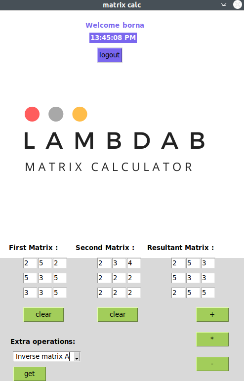

# *Software Engineering Project: Matrix Calculator*

The concept of the application centers around operations between two matrices. Its functionalities include multiplication, addition, and subtraction of two matrices. The application also provides features for calculating matrix transpose, inverse, and determinant.

## Documentation
[Requirement Specification](https://github.com/lifeofborna/ot-harjoitustyo/blob/master/dokumentaatio/vaatimusmaarittely.md)

[Hour Log](https://github.com/lifeofborna/ot-harjoitustyo/blob/master/dokumentaatio/tuntikirjanpito.md)

[Changelog](https://github.com/lifeofborna/ot-harjoitustyo/blob/master/dokumentaatio/changelog.md)

[Architecture](https://github.com/lifeofborna/ot-harjoitustyo/blob/master/dokumentaatio/arkkitehtuuri.md)

[Releases](https://github.com/lifeofborna/ot-harjoitustyo/releases)

[User Guide](https://github.com/lifeofborna/ot-harjoitustyo/blob/master/dokumentaatio/kayttoohje.md)

[Testing](https://github.com/lifeofborna/ot-harjoitustyo/blob/master/dokumentaatio/testaus.md)

## Installation

1. Install the necessary dependencies:
>**poetry install**

2. Starting the application is done as follows:
>**poetry run invoke start**

## Command Line Operations

### Starting the Application:
>**poetry run invoke start**

### Running the Application Tests
>**poetry run invoke test**

### Running Test Coverage
> **poetry run invoke coverage-report** 
> 
Report can be found in the htmlcov directory.

### Pylint checks are performed:
> **poetry run invoke lint**
