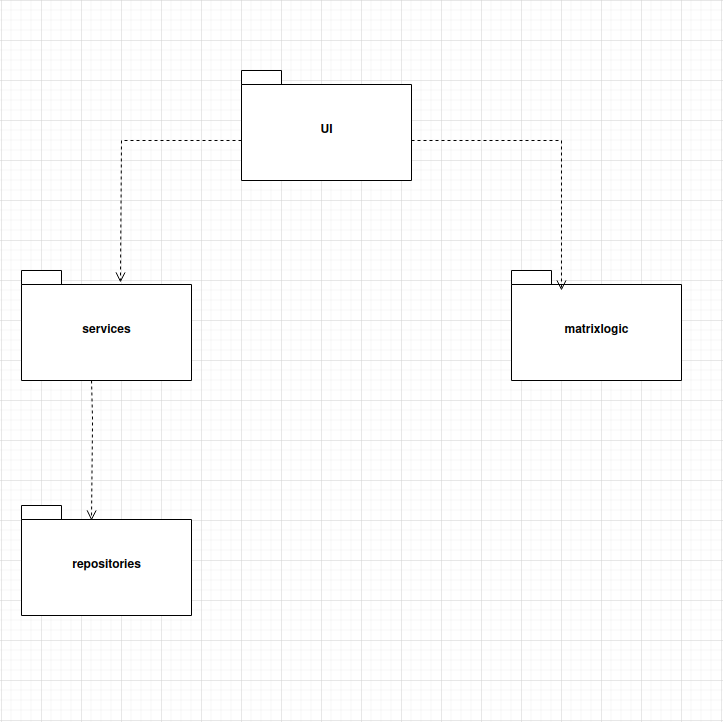
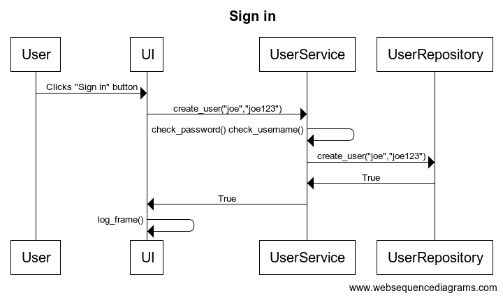
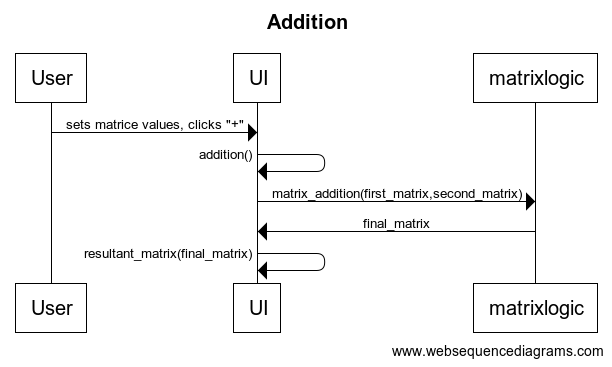

# Arkkitehtuurikuvaus

## Rakenne

*Pakkausrakenne:* 



Pakkaus ui sisältää graafisen käyttöliittymän koodin joka hyödyntää pakkausta matrixcalculator jossa on matriisi operaatioiden sovelluslogiikka. Ui myös hyödyntää eri käyttäjän tietokantaoperaatioita pakkauksesta repositories.

## Sovelluslogiikka

* [matrixlogic](https://github.com/lifeofborna/ot-harjoitustyo/blob/master/src/matrixcalculator/matrixlogic.py)

Käyttöliittymä hyödyntää esimerkiksi metodeja:

 `matrix_addition(matrix1,matrix2),`

 `matrix_substraction(matrix1,matrix2),`
 
 `matrix_multiplication(matrix1,matrix2),`

Käyttöliittymä myös hyödyntää user_service luokkaa.
* [user_service](https://github.com/lifeofborna/ot-harjoitustyo/blob/master/src/services/user_service.py)

`create_user(username,password)`

`login_user(username,password)`

Matrixlogic luokassa tehdään erilaisia operaatioita käyttäjän syöttämiin matriiseihin ja user_service vastaa käyttäjä hallinasta vastaavasta logiikasta hyödyntämällä user_repositoryn tietokantaoperaatiota. 

## Tietojen pysyväistallennus
Tietojen pysyväistallennuksesta vastaa luokka
* user_repository

Sisältää seuraavia metodeja: 
```
create_user(user,password)
```
```
login_user(user,password)
```
Näiden metodejen avulla tiedot käyttäjistä tallennetaan SQLite tietokantaan. 

## Päätoiminnallisuudet

#### *Käyttäjän rekisteröinti*
 



Kun käyttäjä asettaa käyttäjän ja salasanan niin käyttöliittymä kutsuu UserService luokkaa metodilla create_user(). UserService metodi seuraavaksi tarkistaa onko annettu käyttäjätunnus / salasana oikean pituisia ja tämän jälkeen kutsuu luokkaa UserRepository. UserRepository tarkistaa, että käyttäjätunnus ei ole olemassa ja tämän jälkeen käyttää tietokantaoperaatioita ja luo käyttäjän ja palauttaa True. UserService tietää että käyttäjä on nyt luotu ja palauttaa UI;lle True ja ui päivittää käyttöliittymän. 

#### *Käyttäjän kirjautuminen*
 


Kun käyttäjä asettaa käyttäjän ja salasanan ja painaa "sign in" näppäintä niin tapahtumakäsittelijä kutsuu UI funktiota login_user(). Tämän jälkeen UI kutsuu UserService luokkaa metodilla login_user(). Vastaavasti UserService kutsuu luokkaa UserRepository ja tarkistaa onko tietokannassa haluttua käyttäjää oikealla salasanalla. Jos käyttäjä löytyy tämä palauttaa True UserService metodille ja samoin UserService palauttaa True UI, josta UI vaihtaa näkymää matriisi laskimeen.

#### *Yhteenlaskuoperaatio:* 



Kun graafiseen käyttöliittymään asetetaan matriisien arvot ja tämän jälkeen painetaan yhteenlasku näppäintä, niin tapahtumakäsittelijä kutsuu funktiota addtion. Tämän jälkeen funktiossa otetaan vastaan käyttäjän syöttämät matriisit ja suoritetaan yhteenlasku operaatio hyödyntäen matrixlogic luokkaa. Jonka jälkeen palautuu matriisi johon yhteenlasku operaatio on suoritettu tämän jälkeen UI luokka asettaa tämän matriisin näkyville UI funktiolla resultant_matrix. 


### *Muut toiminallisuudet*
Yllä näkyvät tärkeimmät toiminallisuudet ja niiden kuvaukset. Loput toiminallisuuksista toimivat melkein samalla logiikalla. 
