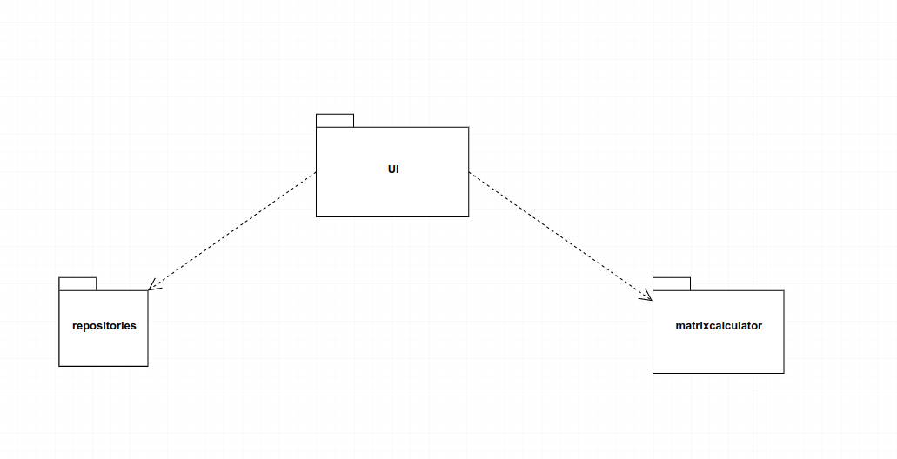

# Arkkitehtuurikuvaus

## Rakenne

*Pakkausrakenne:* 



Pakkaus ui sisältää graafisen käyttöliittymän koodin joka hyödyntää pakkausta matrixcalculator jossa on matriisi operaatioiden sovelluslogiikka. Ui myös hyödyntää eri käyttäjän tietokantaoperaatioita pakkauksesta repositories.

## Sovelluslogiikka

* [matrixlogic](https://github.com/lifeofborna/ot-harjoitustyo/blob/master/src/matrixcalculator/matrixlogic.py)

Käyttöliittymä hyödyntää esimerkiksi metodeja:

 `matrix_addition(matrix1,matrix2),`

 `matrix_substraction(matrix1,matrix2),`
 
 `matrix_multiplication(matrix1,matrix2),`

* [user_repository](https://github.com/lifeofborna/ot-harjoitustyo/blob/master/src/repositories/user_repository.py)

matrixlogic luokassa tehdään erilaisia operaatioita käyttäjän syöttämiin matriiseihin ja user_repository vastaa tietokannan hallitsemisesta ja sen päivitykseen liittyvästä logiikasta. 

## Tietojen pysyväistallennus
Tietojen pysyväistallennuksesta vastaa luokka
* user_repository

Sisältää seuraavia metodeja: 
```
create_user(user,password)
```
```
login_user(user,password)
```
Näiden metodejen avulla tiedot käyttäjistä tallennetaan SQLite tietokantaan. 

## Päätoiminnallisuudet
*Yhteenlaskuoperaatio:* 


Kun graafiseen käyttöliittymään asetetaan matriisien arvot ja tämän jälkeen painetaan yhteenlasku näppäintä, niin tapahtumakäsittelijä kutsuu funktiota addtion. Tämän jälkeen funktiossa otetaan vastaan käyttäjän syöttämät matriisit ja suoritetaan yhteenlasku operaatio hyödyntäen matrixlogic luokkaa. Jonka jälkeen palautuu matriisi johon yhteenlasku operaatio on suoritettu tämän jälkeen UI luokka asettaa tämän matriisin näkyville UI funktiolla resultant_matrix. 
