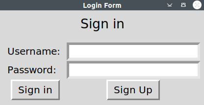
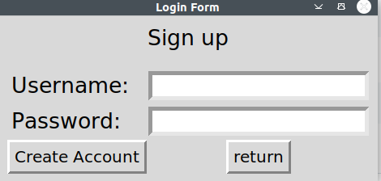
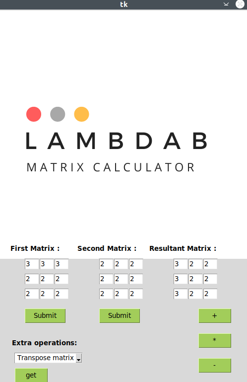

# Käyttöohje

## Ohjelman käynnistäminen
Ohjelman voi käynnistää seuraavin komennoin: 

Asenna ensin tarvittavat riippuvuudet projektille:
```bash
poetry install
```
Nyt suorita seuraava komento ohjelman käynnistämiseen:
```bash
poetry run invoke start
```

## Ohjelmaan kirjautuminen
Kun olet käynnistänyt ohjelman sinun tulee kirjautua sisään.

## Kirjaudu sisään
Tässä näkymässä voit asettaa salasanan ja käyttäjätunnuksen ja kirjautua sisään 'Sign in' näppäimellä.


## Uuden käyttäjän luominen
Jotta voit luoda uuden käyttäjän paina nappia "Sign up" joka vie sinut seuraavaan näkymään: 


Voit nyt luoda käyttäjä tunnuksen ja painaa 'Create Account' nappia joka vie sinut takaisin kirjautumis näkymään jossa voit kirjautua sisään
luomallasi käyttäjätunnuksella. Vaihtoehtoisesti voit myös painaa nappia 'Return' joka myös palaa takaisin kirjautumisnäkymään.


## Matriisilaskennan operaatiot
Kun olet kirjautunut sisään voit asettaa kahteen matriisiin arvoja laskea haluttuja operaatioita painamalla +-* näppäimiä oikealla.
Halutessa voit myös laskea erillaisia matriisi operaatioita avaamalla pudotusvalikko, valitsemalla haluttu operaatio ja painamalla get näppäintä.
Tulokset tulevat näkyviksi 'Resultant Matrix' matriisin kohdalle. Determinantissa avautuu uusi ikkuna, joka kertoo determinantin.



## Sovelluksen lopettaminen
Käyttäjä voi kirjautua ulos painamalla logout nappia.
Sovelluksen voi kokonaan lopettaa painamalla oikealla yläkulmassa olevaa rastia.
